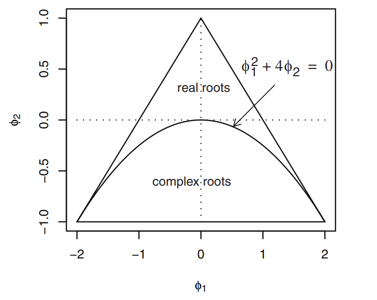

```{r setup, include=FALSE}
knitr::opts_chunk$set(
  echo = TRUE,
  warning = FALSE,
  message = FALSE,
  fig.align = "center",
  fig.width = 3.0,
  fig.height = 2.5)
library(TSA)
library(ggplot2)
library(cowplot)
data(wages)
data(beersales)
```

## 1.1 Förberedelseuppgifter

### a) 
Vi arbetar med följande modell:
$$Y_{t} = 0.1t + e_{t} - 0.4e_{t-1} + 0.7e_{t-2},$$

där $E[e_{t}] = 0$ och $V[e_{t}] = \sigma^2$. 

Väntevärdesfunktionen är:

$$
\begin{aligned}
E[Y_{t}] &= E[0.1t + e_{t} - 0.4e_{t-1} + 0.7e_{t-2}] \\
&= 0.1E[t] + E[e_{t}] - 0.4E[e_{t-1}] + 0.7E[e_{t-2}] \\
&= 0.1t + 0 + 0 + 0 \\
&= 0.1t
\end{aligned}
$$
Som vi kan se är väntevärdet beroende av t, vilket innebär att processen inte är stationär.

Kovariansfunktionen är:
$$
\begin{aligned}
Cov[Y_{t}, Y_{t-k}] &= Cov[0.1t + e_{t} - 0.4e_{t-1} + 0.7e_{t-2}, 0.1_{t-k} + e_{t-k} - 0.4e_{t-k-1} + 0.7e_{t-k-2}] \\
&= Cov[e_{t}, e_{t-k}] - 0.4Cov[e_{t}, e_{t-k-1}] + 0.7Cov[e_{t}, e_{t-k-2}] \\
&\quad - 0.4Cov[e_{t-1}, e_{t-k}] + 0.4^2Cov[e_{t-1}, e_{t-k-1}] - 0.4 \cdot 0.7Cov[e_{t-1}, e_{t-k-2}] \\
&\quad + 0.7Cov[e_{t-2}, e_{t-k}] - 0.7 \cdot 0.4Cov[e_{t-2}, e_{t-k-1}] + 0.7^2Cov[e_{t-2}, e_{t-k-2}]
\end{aligned}
$$
Det här resulterar i att vi får olika kovariansfunktioner beroende på $k$. Följande gäller:

$$
Cov[Y_{t}, Y_{t-k}] = \begin{cases}
0 &\text{när } k < -2 \\[5pt]
0.7Cov[e_{t}, e_{t-k-2}] &\text{när } k=-2 \\[5pt]
- 0.4Cov[e_{t}, e_{t-k-1}] - 0.7 \cdot 0.4Cov[e_{t-2}, e_{t-k-1}] &\text{när } k=-1 \\[5pt]
Cov[e_{t}, e_{t-k}] + 0.4^2Cov[e_{t-1}, e_{t-k-1}] + 0.7^2Cov[e_{t-2}, e_{t-k-2}] &\text{när } k=0 \\[5pt]
- 0.4Cov[e_{t-1}, e_{t-k}] - 0.7 \cdot 0.4Cov[e_{t-2}, e_{t-k-1}] &\text{när } k=1 \\[5pt]
0.7Cov[e_{t-2}, e_{t-k}] &\text{när } k=2 \\[5pt]
0 &\text{när } k > 2 \\
\end{cases}
$$
Givet att $Var[e_{t}] = \sigma^2$, får vi följande kovarianstermer:

$$
Cov[Y_{t}, Y_{t-k}] = \begin{cases}
0 &\text{när } k < -2 \\[5pt]
0.7 \sigma^2 &\text{när } k=-2 \text{ eller } k=2 \\[5pt]
- 0.68\sigma^2 &\text{när } k=-1 \text{ eller } k=1 \\[5pt]
1.65\sigma^2 &\text{när } k=0 \\[5pt]
0 &\text{när } k > 2 \\
\end{cases}
$$
Nu ska vi istället undersöka differensbildningen $\nabla Y_{t}$. Dess väntevärde är:

$$
\begin{aligned}
E[\nabla Y_{t}] &= E[Y_{t} - Y_{t-1}] \\
&= E[0.1t + e_{t} - 0.4e_{t-1} + 0.7e_{t-2}] - 0.1_{t-1} + e_{t-1} - 0.4e_{t-2} + 0.7e_{t-3}] \\
&= E[0.1t + e_{t} - 0.4e_{t-1} + 0.7e_{t-2}] - 0.1t + 0.1 - e_{t-1} + 0.4e_{t-2} - 0.7e_{t-3}] \\
&= 0.1 + E[e_{t}] - 1.4E[e_{t-1}] + 1.1E[e_{t-2}] - 0.7E[e_{t-3}] \\
&= 0.1
\end{aligned}
$$

Väntevärdesfunktionen är alltså konstant över tiden $t$, vilket är ett av kriterierna för att en process ska vara stationär. Härnäst undersöker vi kovariansfunktionen:

$$
\begin{aligned}
Cov[\nabla Y_{t}, \nabla Y_{t-k}]
&= Cov[Y_{t} - Y_{t-1}, Y_{t-k} - Y_{t-k-1}] \\
&= Cov[0.1t + e_{t} - 0.4e_{t-1} + 0.7e_{t-2}] - 0.1_{t-1} - e_{t-1} + 0.4e_{t-2} - 0.7e_{t-3}, \\
& \qquad 0.1_{t-k} + e_{t-k} - 0.4e_{t-k-1} + 0.7e_{t-k-2}] - 0.1_{t-k-1} - e_{t-k-1} + 0.4e_{t-k-2} - 0.7e_{t-k-3}] \\
&= Cov[e_{t} - 1.4e_{t-1} + 1.1e_{t-2} - 0.7e_{t-3}, e_{t-k} - 1.4e_{t-k-1} + 1.1e_{t-k-2} - 0.7e_{t-k-3}] \\
&= Cov[e_{t}, e_{t-k}] - 1.4Cov[e_{t}, e_{t-k-1}] + 1.1Cov[e_{t}, e_{t-k-2}] - 0.7 Cov[e_{t}, e_{t-k-3}] \\
& \quad - 1.4Cov[e_{t-1}, e_{t-k}] + 1.4^2Cov[e_{t-1}, e_{t-k-1}] - 1.4 \cdot 1.1Cov[e_{t-1}, e_{t-k-2}] + 1.4 \cdot 0.7 Cov[e_{t-1}, e_{t-k-3}] \\
& \quad + 1.1Cov[e_{t-2}, e_{t-k}] - 1.1 \cdot 1.4 Cov[e_{t-2}, e_{t-k-1}] + 1.1^2 Cov[e_{t-2}, e_{t-k-2}] - 1.1 \cdot 0.7 Cov[e_{t-2}, e_{t-k-3}] \\
& \quad - 0.7Cov[e_{t-3}, e_{t-k}] + 0.7 \cdot 1.4 Cov[e_{t-3}, e_{t-k-1}] - 0.7 \cdot 1.1 Cov[e_{t-3}, e_{t-k-2}] + 0.7^2Cov[e_{t-3}, e_{t-k-3}] \\
\end{aligned}
$$

Återigen får vi olika resultat beroende på vad k sätts till. Följande kovarianstermer gäller:

$$
Cov[\nabla Y_{t}, \nabla Y_{t-k}] = \begin{cases}
0 &\text{när } k < -3 \\[5pt]
- 0.7 Cov[e_{t}, e_{t-k-3}] &\text{när } k = -3 \\[5pt]
1.1Cov[e_{t}, e_{t-k-2}] + 1.4 \cdot 0.7 Cov[e_{t-1}, e_{t-k-3}] + 1.1^2 Cov[e_{t-2}, e_{t-k-2}] &\text{när } k = -2 \\[5pt]
- 1.4Cov[e_{t}, e_{t-k-1}] - 1.4 \cdot 1.1Cov[e_{t-1}, e_{t-k-2}] - 1.1 \cdot 0.7 Cov[e_{t-2}, e_{t-k-3}] &\text{när } k = -1 \\[5pt]
Cov[e_{t}, e_{t-k}] + 1.4^2Cov[e_{t-1}, e_{t-k-1}] + 1.1^2 Cov[e_{t-2}, e_{t-k-2}] + 0.7^2Cov[e_{t-3}, e_{t-k-3}] &\text{när } k = 0 \\[5pt]
- 1.4Cov[e_{t-1}, e_{t-k}] - 1.1 \cdot 1.4 Cov[e_{t-2}, e_{t-k-1}] - 0.7 \cdot 1.1 Cov[e_{t-3}, e_{t-k-2}] &\text{när } k = 1 \\[5pt]
1.1Cov[e_{t-2}, e_{t-k}] + 0.7 \cdot 1.4 Cov[e_{t-3}, e_{t-k-1}] &\text{när } k = 2 \\[5pt]
- 0.7Cov[e_{t-3}, e_{t-k}] &\text{när } k = 3 \\[5pt]
0 &\text{när } k > 3 \\
\end{cases}
$$
Ytterligare förenklat kan detta skrivas som:

$$
Cov[\nabla Y_{t}, \nabla Y_{t-k}] = \begin{cases}
0 &\text{när } k < -3 \\[5pt]
- 0.7 \sigma^2 &\text{när } k = -3 \text{ eller } k = 3\\[5pt]
3.29\sigma^2 &\text{när } k = -2 \text{ eller } k = 2 \\[5pt]
- 3.71\sigma^2 &\text{när } k = -1 \text{ eller } k = 1 \\[5pt]
4.66\sigma^2 &\text{när } k = 0 \\[5pt]
0 &\text{när } k > 3 \\
\end{cases}
$$
Av detta kan vi dra slutsatsen att kovariansen enbart påverkas av tidslaggen $k$, och inte tiden $t$ i sig. Därmed är den differentierade processen $\nabla Y(t)$ en stationär process.

\newpage

## 2 Trendanalys

I följande avsnitt kommer vi att undersöka två datamaterial och försöka identifiera de underliggande trenderna. Data material vi kommer att arbeta med är `wages` och `beersales`.

### Linjär trendmodell

En linjär trendmodell har formen $Y(t) = \mu (t) + X(t)$, där $\mu (t) = \beta_0 + \beta_1t + \beta_2t^2$ kan användas för att avtrendifiera datamaterial som har en väntevärdefunktion som ökar med tiden. I det här fallet använder vi oss både av en linjär och en kvadratisk term i vår modell. Vi ska nu anpassa den till de två datamaterialen.

#### Wages

Med följande kod kan vi konstruera en linjär trendmodell och undersöka dess residualer och autokorrelationsfunktion för att se om den passar `wages``.

```{r lmwages, fig.cap = 'Autokorrelations- och normalkvantilplottar för linjär modell av wages samt residualerna Xt.', fig.width=6.0, fig.height=4.5}
lm_wages <- lm(wages ~ time(wages) + I(time(wages)^2))
Xt <- residuals(lm_wages)
par(mfrow=c(2,2))
acf(wages)
acf(Xt)
qqnorm(wages)
qqnorm(Xt)
```

Som vi kan se i diagrammet längst upp till höger återstår viss autokorrelation fortfarande bland residualerna. Detta tyder på att modellen inte passar fullt ut. Vi kan dock konstatera att residualerna följer en normalfördelning hyfsat bra, vilket tyder på ett bra modellval.

#### Beersales

På liknande sätt kan vi nu undersöka om en linjär trendmodell passar `beersales`. 

```{r lmbeersales, echo = FALSE, fig.cap='Autokorrelations- och normalkvantilplottar för linjär modell av beersales samt residualerna Xt.', fig.width=6.0, fig.height=4.5}
lm_beersales <- lm(beersales ~ time(beersales) + I(time(beersales)^2))
Xt <- residuals(lm_beersales)
par(mfrow=c(2,2))
acf(beersales)
acf(Xt)
qqnorm(beersales)
qqnorm(Xt)
```
I figuren ovan framgår att en linjär modell passar datamaterialet väldigt dåligt. Det kan vi se eftersom väldigt mycket autokorrelation kvarstår trots vårt försök att "avtrendifiera" materialet genom modellvalet. Dessutom följer residualerna inte alls en normalfördelning. Vi kan direkt se i residualerna att de har en mer vågig form och således antagligen bättre avtrendifieras av en cyklisk modell av något slag.

### Säsongsmodell

En säsongsmodell är precis vad namnet indikerar - en modell som kan beskriva en hur ett datamaterial varierar över säsonger, till exempel månadsvis. Ett klassiskt och enkelt exempel på där det passar bra är temperatur. Med hjälp av funktionen `season` kan vi enkelt undersöka om en modell på den här formen, $Y(t) = \beta_i + X(t)$ - där $\beta_i$ är ett säsongsmedelvärde för säsongen $i$, passar materialen. 

#### Wages

Nedan konstruerar vi säsongsmodellen för wages.

```{r seasonwages}
# No intercept
month.<-season(wages)
season_wages <-lm(wages~month.)
```

```{r seasonwagesplots, echo = FALSE, fig.cap='Autokorrelations- och normalkvantilplottar för residualerna Xt från säsongsmodell av wages.', fig.width=6.0, fig.height=3}
Xt <- residuals(season_wages)
par(mfrow=c(1,2))
acf(Xt)
qqnorm(Xt)
```

Då både mycket autokorrelation återstår och residualerna uppvisar ett väldigt dåligt mönster i relation till en normalfördelning kan vi konstatera att säsongsmodellen inte passar datan i wages särskilt bra.

#### Beersales

Vidare kan vi tänka oss att modellen passar bättre för `beersales`, som ser ut att ha något av ett säsongsmönster i sig.

```{r seasonbeersales, echo = FALSE, fig.cap='Autokorrelations- och normalkvantilplottar för residualerna Xt från säsongsmodell av beersales.', fig.width=6.0, fig.height=3}
month.bs <- season(beersales)
# No intercept
season_beersales <- lm(beersales~month.bs)
Xt <- residuals(season_beersales)
par(mfrow=c(1,2))
acf(Xt)
qqnorm(Xt)
```
Med en säsongsmodell anpassad till beersales får vi en relativt bra fördelning på residualerna. Mycket autokorrelation kvarstår dock. Härnäst ska vi därför undersöka om en periodisk modell kan passa datamaterial bättre.

### Periodisk modell

En periodisk modell på formen $Y(t) = \mu (t) + X(t)$, där $\mu(t) = \beta_0 + \beta_1 cos(2\pi ft) + \beta_2 sin(2\pi ft)$ kan prövas på materialet med hjälp av funktionen `harmonic`.

#### Wages

Vi börjar med att anpassa modellen till lönedatan med hjälp av nedanstående kod.

```{r harwages}
har. <- harmonic(wages, 1)
har_wages <- lm(wages ~ har.)
```

```{r harwagesplots, echo = FALSE, fig.cap='Autokorrelations- och normalkvantilplottar för residualerna Xt från periodisk modell av wages.', fig.width=6.0, fig.height=3}
Xt <- residuals(har_wages)
par(mfrow=c(1,2))
acf(Xt)
qqnorm(Xt)
```

I figuren ovan kan vi snabbt konstatera att autokorrelationen kvarstår i residualerna samt att de inte är normalfördelade. Det är inte särskilt förvånande då materialet inte heller sett ut att ha en harmonisk-periodisk trend.

#### Beersales

I nedanstående figur kan vi se resultatet för residualerna efter att ha anpassat den periodiska modellen till `beersales`.

```{r harbeersales, echo = FALSE, fig.cap='Autokorrelations- och normalkvantilplottar för residualerna Xt från periodisk av beersales.', fig.width=6.0, fig.height=3}
har. <- harmonic(beersales, 1)
har_beersales <- lm(beersales ~ har.)
Xt <- residuals(har_beersales)
par(mfrow=c(1,2))
acf(Xt)
qqnorm(Xt)
```
I det här fallet följer residualerna en normalfördelning på ett tillfredställande sätt, men mycket autokorrelation kvarstår. Kanske kan istället en kombination av de testade modellerna passa det här materialet?

### Kombination

I fallet med `wages` kan vi konstatera att en linjär modell verkar passa material bäst, även om en del autokorrelation fortfarande kvarstår. För `beersales` har ingen av de prövade modellerna passat särskilt bra. Därför provar vi nu en kombination av de föreslagna modellerna för att se om vi kan få fram en modell som på ett tillfredställande sätt kan avtrendifierade materialet. Nedan har testat modellen $Y(t) = \mu (t) + X(t)$, där $\mu(t) = \beta_0 + \beta_1 cos(2\pi ft) + \beta_2 sin(2\pi ft) + \beta_3 t + \beta_4 t^2$.

```{r combmod}
har. <- harmonic(beersales, 1)
model <- lm(beersales~ har. + time(beersales) + I(time(beersales)^2))
Xt <- residuals(model)
summary(model)
```

```{r combplot, echo = FALSE, fig.cap='Autokorrelations- och normalkvantilplottar för residualerna Xt från en kombination av linjär och periodisk modell av beersales.', fig.width=6.0, fig.height=3}
par(mfrow=c(1,2))
acf(Xt)
qqnorm(Xt)
```

I det här fallet ser modellen ut att passa materialet ganska bra. Efter avtrendifiering via modellen återstår väldigt lite autokorrelation i residualerna, och dessa är också normalfördelade.

## 3 Simulering av ARMA(p,q)-processer

### 3.2 AR(1) - MA(1) processer

##### AR(1)

Vi börjar med att simulera två datamaterial från en AR(1)-process med $\phi = \pm0.9$ och 400 realiseringar vardera.

```{r ar11}
AR1_0.9_p <- arima.sim(model = list(ar=c(0.9)), n= 400, sd = 1)
AR1_0.9_n <- arima.sim(model = list(ar=c(-0.9)), n= 400, sd = 1)
```

```{r ar12, echo = FALSE, fig.cap='Tiddserie plottar över AR(1)-processer $\\phi = 0.9$, t.h. $\\phi = -0.9$.', fig.width=6.0, fig.height=3}
par(mfrow=c(1,2))
plot(AR1_0.9_p)
plot(AR1_0.9_n)
```

Då $\phi = 0.9$ så ser vi att processen sällan korsar det teoretiska väntevärdet, $E[Y_t] = 0$ och istället tenderar att stanna en längre period över eller under 0 innan den korsar igen. Om en realisering är positiv tenderar alltså nästa realisering att också vara positiv och vise versa. Då $\phi = -0.9$ tenderar processen att centrera runt det teoretiska väntevärdet 0 men alternera mer frekvent mellan positiv och negativ realisering. 

```{r ar13, echo = FALSE, fig.cap='Autokorrelation för de två AR(1)-processerna.', fig.width=6.0, fig.height=3}
par(mfrow=c(1,2))
acf(AR1_0.9_p)
acf(AR1_0.9_n)
```

Vad gäller autokorrelation ser vi att, då $\phi = 0.9$, så är korrelationen starkt positiv vid få lag och minskar stadigt med antalet lag. Efter fler än cirka 15 lag tenderar autokorrelationen att bli oskiljbar från noll vid 5% signifikansnivå. Realiseringen stämmer förhållandevis väl överrens med den teoretiska autokorrelationen (figur \@ref(fig:ar14)) på så sätt att den initiellt är starkt positivt korrelerad vid låga lag och $\rightarrow 0$ när tidslagget ökar. Då istället $\phi = -0.9$ är korrelationen vid det första tidslagget starkt negativ men altenerar sedan mellan positivt och negativ för varje tidslagg, samtidigt som autokorrelationen $\rightarrow 0$ när tidslagget ökar.

```{r ar14, echo = FALSE, fig.cap='Teoretisk autokorrelation för de två AR(1)-processerna.', fig.width=6.0, fig.height=2.5}
ARMAacf_0.9_p = data.frame(x = seq(0, 50), y = ARMAacf(ar=c(0.9), lag.max = 50))

g1 <- ggplot(ARMAacf_0.9_p, aes(x=x, y=y)) +
  geom_point() + 
  geom_segment( aes(x=x, xend=x, y=0, yend=y)) +
  labs(x = 'Lag', y = 'Teoretisk autokorrelation', subtitle = expression(phi * ' = 0.9')) +
  theme_minimal()

ARMAacf_0.9_n = data.frame(x = seq(0, 50), y = ARMAacf(ar=c(-0.9), lag.max = 50))

g2 <- ggplot(ARMAacf_0.9_n, aes(x=x, y=y)) +
  geom_point() + 
  geom_segment( aes(x=x, xend=x, y=0, yend=y)) +
  labs(x = 'Lag', y = 'Teoretisk autokorrelation', subtitle = expression(phi * ' = -0.9')) +
  theme_minimal()

plot_grid(g1, g2)
```


##### MA(1)

Vi börjar med att simulera två datamaterial från en MA(1)-process med $\theta = \pm0.9$ och 400 realiseringar vardera.


```{r ma11}
MA1_pos <- arima.sim(model = list(ma=c(0.9)), n= 400, sd = 1)
MA1_neg <- arima.sim(model = list(ma=c(-0.9)), n= 400, sd = 1)
```

```{r ma12, echo = FALSE, fig.cap='Tiddserie plottar över MA(1)-processer teta = 0.9 på vänster sida och då teta = -0.9 på höger sida', fig.width=6.0, fig.height=3}
par(mfrow=c(1,2))
plot(MA1_pos)
plot(MA1_neg)
```
Här ser vi liknande resultat som i vid AR(1)-process. Då $\theta = 0.9$ tenderar processen att ställan korsa det teoretiska väntevärdet, $E[Y_t] = 0$ och istället stannar den en längre period över eller under 0 innan den korsar igen. Då $\theta = -0.9$ tenderar processen att centrera runt det teoretiska väntevärdet 0 men alternera mellan positiv och negativ realisering.

```{r ma13, echo = FALSE, fig.cap='Autokorrelation för de två MA(1)-processerna.', fig.width=6.0, fig.height=3}
par(mfrow=c(1,2))
acf(MA1_pos)
acf(MA1_neg)
```

Då $\theta = 0.9$ har första laggen relativt stor positiv korrelation (runt 0.5) men sedan går inte
korrelationen att skilja från 0 vid 5 % signifikansnivå för ytterligare tidslagg. I figur \@ref(fig:ma14) kan vi se att den teoretiska korrelationen vid den första laggen ska vara ca 0.5 positiv korrelation och att korrelationen sedan blir 0 vid vidare lag. Då $\theta = -0.9$ har första laggen relativt stor negativ korrelation (runt 0.5) men sedan går inte korrelationen att skilja från 0 vid 5% signifikansnivå för ytterligare tidslagg. Teoretiskt ser vi att den första laggen ska vara ca 0.5 negativ korrelation och att korrelationen sedan blir 0 vid vidare lag.

```{r ma14, echo = FALSE, fig.cap='Teoretisk autokorrelation för de två MA(1)-processerna.', fig.width=6.0, fig.height=2.5}
ARMAacf_0.9_p = data.frame(x = seq(0, 10), y = ARMAacf(ma=c(0.9), lag.max = 10))

g1 <- ggplot(ARMAacf_0.9_p, aes(x=x, y=y)) +
  geom_point() + 
  geom_segment( aes(x=x, xend=x, y=0, yend=y)) +
  labs(x = 'Lag', y = 'Teoretisk autokorrelation', subtitle = expression(theta * ' = 0.9')) +
  theme_minimal()

ARMAacf_0.9_n = data.frame(x = seq(0, 10), y = ARMAacf(ma=c(-0.9), lag.max = 10))

g2 <- ggplot(ARMAacf_0.9_n, aes(x=x, y=y)) +
  geom_point() + 
  geom_segment( aes(x=x, xend=x, y=0, yend=y)) +
  labs(x = 'Lag', y = 'Teoretisk autokorrelation', subtitle = expression(theta * ' = -0.9')) +
  theme_minimal()

plot_grid(g1, g2)
```

### 3.3 AR(2)-processer
{height=30%}


#### Stationära positiva reella rötter
Vi börjar med att välja två stationära positiva reella rötter för den karaktäristiska ekvationen och analyserar processen Vi börjar med $\phi_1=0.45, \phi_2=0.5$.
```{r ar21}
AR2_pos_pos <- arima.sim(model = list(ar=c(0.45, 0.5)), n= 400, sd = 1)
```

```{r ar212, echo = FALSE, fig.cap='Teoretisk autokorrelation för AR(2)-processen med två positiva koefficienter.', fig.width=4.0, fig.height=2.5}
ARMAacf_ar2_pp = data.frame(x = seq(0, 50), y = ARMAacf(ar=c(0.45, 0.5), lag.max = 50))

ggplot(ARMAacf_ar2_pp, aes(x=x, y=y)) +
  geom_point() + 
  geom_segment( aes(x=x, xend=x, y=0, yend=y)) +
  labs(x = 'Lag', y = 'Teoretisk autokorrelation', subtitle = expression(phi[1] * ' = 0.45, ' * phi[2] * ' = 0.5')) +
  theme_minimal()
```

```{r ar22, echo = FALSE, fig.cap='Tidsserie och autokorrelation för AR(2)-process med två positiva koefficienter.', fig.width=6.0, fig.height=3}
par(mfrow=c(1,2))
plot(AR2_pos_pos)
acf(AR2_pos_pos, lag.max = 50)
```
Då modellen har reella rötter som båda är positiva ser vi att modellen tenderar att sällan korsa det teoretiska väntevärdet 0. Om en observation är positiv tenderar nästa observation att också vara positiv. Det krävs förhållandevis stora lag för att korrelationen ska försvinna, alltså oskiljbar från noll vid signifikansnivå 5%. Teoretiskt så går autokorrelation mot noll när tidslagget ökar. 

#### Stationära reella rötter då den första är koefficienten är negativ och den andra är positiv
Vi simluerar nu data från en process med koefficienterna $\phi_1=-0.45$ och $\phi_2=0.5$.
```{r ar23}
AR2_neg_pos <- arima.sim(model = list(ar=c(-0.45, 0.5)), n= 400, sd = 1)
```

```{r ar2npplot, echo = FALSE, fig.cap='Teoretisk autokorrelation för AR(2)-processen med en positiv och en negativ koefficient.', fig.width=4.0, fig.height=2.5}
ARMAacf_ar2_np = data.frame(x = seq(0, 50), y = ARMAacf(ar=c(-0.45, 0.5), lag.max = 50))

ggplot(ARMAacf_ar2_np, aes(x=x, y=y)) +
  geom_point() + 
  geom_segment( aes(x=x, xend=x, y=0, yend=y)) +
  labs(x = 'Lag', y = 'Teoretisk autokorrelation', subtitle = expression(phi[1] * ' = -0.45, ' * phi[2] * ' = 0.5')) +
  theme_minimal()
```


```{r ar24, echo = FALSE, fig.cap='Tidsserie och autokorrelation för AR(2)-process med en positiv och en negativ koefficient.', fig.width=6.0, fig.height=3}
par(mfrow=c(1,2))
plot(AR2_neg_pos)
acf(AR2_neg_pos, lag.max = 50)
```
Då modellen har reella rötter där ena är positiv och den andra är negativ ser vi att modellen tenderar att korsa det teoretiska väntevärdet 0 vid realisering. Serien är centrerad kring 0 men gör stora positiva och negativa hopp. Om en observation är positiv tenderar nästa observation att istället vara negativ, det finns alltså en alternerande egenskap hos autokorrelationsfunktionen. Det tar förhållandevis många lag för att korrelationen ska försvinna.

#### Stationära reella rötter då den båda koefficienterna är negativa.
I följande del simulerar vi en AR(2)-process där $\phi_1=-0.45$ och $\phi_2=-0.5$.
```{r ar25}
AR2_neg_neg <- arima.sim(model = list(ar=c(-0.45, -0.5)), n= 400, sd = 1)
```

```{r ar2nnplot, echo = FALSE, fig.cap='Teoretisk autokorrelation för AR(2)-processen med två negativa koefficienter.', fig.width=4.0, fig.height=2.5}
ARMAacf_ar2_nn = data.frame(x = seq(0, 10), y = ARMAacf(ar=c(-0.45, -0.5), lag.max = 10))

ggplot(ARMAacf_ar2_nn, aes(x=x, y=y)) +
  geom_point() + 
  geom_segment( aes(x=x, xend=x, y=0, yend=y)) +
  labs(x = 'Lag', y = 'Teoretisk autokorrelation', subtitle = expression(phi[1] * ' = -0.45, ' * phi[2] * ' = -0.5')) +
  theme_minimal()
```

```{r ar26, echo = FALSE, fig.cap='Tidsserie och autokorrelation för AR(2)-process med två negativa koefficienter.', fig.width=6.0, fig.height=3}
par(mfrow=c(1,2))
plot(AR2_neg_neg)
acf(AR2_neg_neg, lag.max = 50)
```
Då modellen har reella rötter där båda är negativa ser vi att modellen tenderar att korsa det teoretiska väntevärdet 0 vid realisering. Serien är centrerad kring 0 men gör stora positiva och negativa hopp. Det finns mycket lite autokorrelation vid tidslagg. Samtidigt finns the en teoretisk struktur där korrelationen är runt -0.3 och -0.367 vid det första och andra tidslagget, sedan byter korrelationen tecken vid tredje tidslagget (-0.31) för att sedan avta och gå mot 0 vid ytterligare tidslag.

#### Stationära komplexa rötter då första koefficienten är positiv och andra är negativ.
Vi finner bara stationära processer när den andra koefficienten är negativ och således kan vi bara göra två jämförelser då rötterna är komplexa.
```{r ar27}
AR2_C_pos_neg <- arima.sim(model = list(ar=c(1, -0.5)), n= 400, sd = 1)
```

```{r ar2Cpnplot, echo = FALSE, fig.cap='Teoretisk autokorrelation för AR(2)-processen med två komplexa rötter, då den första koefficienten är positiv och den andra koefficienten är negativ.', fig.width=4.0, fig.height=2.5}
ARMAacf_ar2_C_pn = data.frame(x = seq(0, 10), y = ARMAacf(ar=c(1, -0.5), lag.max = 10))

ggplot(ARMAacf_ar2_C_pn, aes(x=x, y=y)) +
  geom_point() + 
  geom_segment( aes(x=x, xend=x, y=0, yend=y)) +
  labs(x = 'Lag', y = 'Teoretisk autokorrelation', subtitle = expression(phi[1] * ' = 1, ' * phi[2] * ' = -0.5')) +
  theme_minimal()
```

```{r ar28, echo = FALSE, fig.cap='Tidsserie och autokorrelation för AR(2)-process med två komplexa rötter, då den första koefficienten är positiv och den andra koefficienten är negativ.', fig.width=6.0, fig.height=3}
par(mfrow=c(1,2))
plot(AR2_C_pos_neg)
acf(AR2_C_pos_neg, lag.max = 50)
```
Vid komplexa rötter då första koefficienten är positiv har vi initiellt hög positiv korrelation som snabbt avtar men till mot 0 när tidslagg $\rightarrow\infty$. Processen korsar relativt ofta det teoretiska väntevärdet men är inte lika centrerad som vid till exempel vid reella rötter med samma tecken.

#### Stationära komplexa rötter då båda koefficienterna negativa 

Vi simulerar nu en process där både koefficienterna är negativa och rötter är komplexa.

```{r ar29}
AR2_C_neg_neg <- arima.sim(model = list(ar=c(-1, -0.5)), n= 400, sd = 1)
```

```{r ar2Cnnplot, echo = FALSE, fig.cap='Teoretisk autokorrelation för AR(2)-processen med två komplexa rötter, då båda koefficienterna negativa.', fig.width=4.0, fig.height=2.5}
ARMAacf_ar2_C_nn = data.frame(x = seq(0, 10), y = ARMAacf(ar=c(-1, -0.5), lag.max = 10))

ggplot(ARMAacf_ar2_C_nn, aes(x=x, y=y)) +
  geom_point() + 
  geom_segment( aes(x=x, xend=x, y=0, yend=y)) +
  labs(x = 'Lag', y = 'Teoretisk autokorrelation', subtitle = expression(phi[1] * ' = -1, ' * phi[2] * ' = -0.5')) +
  theme_minimal()
```

```{r ar210, echo = FALSE, fig.cap='Tidsserie och autokorrelation för AR(2)-process med två komplexa rötter, då båda koefficienterna negativa.', fig.width=6.0, fig.height=3}
par(mfrow=c(1,2))
plot(AR2_C_neg_neg)
acf(AR2_C_neg_neg, lag.max = 50)
```
Vid komplexa rötter då båda koefficienterna är negativa  har vi initiellt hög negativ korrelation som snabbt avtar men går mot 0 när tidslagg $\rightarrow\infty$. Processen är centrerad kring det teoretiska väntevärdet likt då rötterna är reella och koefficienterna båda är negativa.


### 3.4 ARMA(p,q)

1) En ARMA-process då $\phi = 0.9$ och $\theta = 0.9$.

```{r arma1}
ARMA_pos_pos <- arima.sim(model = list(ar=c(0.9), ma=c(0.9)), n= 400, sd = 1)
```

```{r armappplot, echo = FALSE, fig.cap='Teoretisk autokorrelation för ARMA(0.9 , 0.9)-process.', fig.width=4.0, fig.height=2.5}
ARMAacf_arma = data.frame(x = seq(0, 25), y = ARMAacf(ar=c(0.9), ma=c(0.9), lag.max = 25))

ggplot(ARMAacf_arma, aes(x=x, y=y)) +
  geom_point() + 
  geom_segment( aes(x=x, xend=x, y=0, yend=y)) +
  labs(x = 'Lag', y = 'Teoretisk autokorrelation', subtitle = expression(phi * ' = 0.9, ' * theta * ' = 0.9')) +
  theme_minimal()
```

```{r arma2, echo = FALSE, fig.cap='Tidsserie och autokorrelation för ARMA(0.9 , 0.9)-process.', fig.width=6.0, fig.height=3}
par(mfrow=c(1,2))
plot(ARMA_pos_pos)
acf(ARMA_pos_pos, lag.max = 25)
```

Här sjunker processens autokorrelation stadigt i takt med att laggen ökar, precis som vi enligt de teoretiska värdena kan förvänta oss.

2) En ARMA-process då $\phi = 0.9$ och $\theta = -0.9$.

```{r arma3}
ARMA_pos_neg <- arima.sim(model = list(ar=c(0.9), ma=c(-0.9)), n= 400, sd = 1)
```

```{r armapnplot, echo = FALSE, fig.cap='Teoretisk autokorrelation för ARMA(0.9, -0.9)-process.', fig.width=4.0, fig.height=2.5}
ARMAacf_arma = data.frame(x = seq(0, 25), y = ARMAacf(ar=c(0.9), ma=c(-0.9), lag.max = 25))

ggplot(ARMAacf_arma, aes(x=x, y=y)) +
  geom_point() + 
  geom_segment( aes(x=x, xend=x, y=0, yend=y)) +
  labs(x = 'Lag', y = 'Teoretisk autokorrelation', subtitle = expression(phi * ' = 0.9, ' * theta * ' = -0.9')) +
  theme_minimal()
```

```{r arma4, echo = FALSE, fig.cap='Tidsserie och autokorrelation för ARMA(0.9, -0.9)-process', fig.width=6.0, fig.height=3}
par(mfrow=c(1,2))
plot(ARMA_pos_neg)
acf(ARMA_pos_neg, lag.max = 25)
```
Precis som vi förväntar oss från den teoretiska autokorrelationen så är korrelationen väldigt låg i den här processen. I vår simulerade process ligger den nästan direkt mycket nära 0.

3) En ARMA-process då $\phi = -0.9$ och $\theta = 0.9$.
```{r arma5}
ARMA_neg_pos <- arima.sim(model = list(ar=c(-0.9), ma=c(0.9)), n= 400, sd = 1)
```

```{r armanpplot, echo = FALSE, fig.cap='Teoretisk autokorrelation för ARMA(-0.9, 0.9)-process.', fig.width=4.0, fig.height=2.5}
ARMAacf_arma = data.frame(x = seq(0, 25), y = ARMAacf(ar=c(-0.9), ma=c(0.9), lag.max = 25))

ggplot(ARMAacf_arma, aes(x=x, y=y)) +
  geom_point() + 
  geom_segment( aes(x=x, xend=x, y=0, yend=y)) +
  labs(x = 'Lag', y = 'Teoretisk autokorrelation', subtitle = expression(phi * ' = -0.9, ' * theta * ' = 0.9')) +
  theme_minimal()
```

```{r arma6, echo = FALSE, fig.cap='Tidsserie och autokorrelation för ARMA(0.9 , 0.9)-process', fig.width=6.0, fig.height=3}
par(mfrow=c(1,2))
plot(ARMA_neg_pos)
acf(ARMA_neg_pos, lag.max = 25)
```

I det här fallet ser vi samma mönster som i föregående exempel, mycket liten autokorrelation, vilket ligger i linje med vad vi kan förvänta oss utifrån de teoretiska värdena.

4) En ARMA-process då $\phi = -0.9$ och $\theta = -0.9$.
```{r arma7}
ARMA_neg_neg <- arima.sim(model = list(ar=c(-0.9), ma=c(-0.9)), n= 400, sd = 1)
```

```{r armannplot, echo = FALSE, fig.cap='Teoretisk autokorrelation för ARMA(-0.9, -0.9)-process.', fig.width=4.0, fig.height=2.5}
ARMAacf_arma = data.frame(x = seq(0, 25), y = ARMAacf(ar=c(-0.9), ma=c(-0.9), lag.max = 25))

ggplot(ARMAacf_arma, aes(x=x, y=y)) +
  geom_point() + 
  geom_segment( aes(x=x, xend=x, y=0, yend=y)) +
  labs(x = 'Lag', y = 'Teoretisk autokorrelation', subtitle = expression(phi * ' = -0.9, ' * theta * ' = -0.9')) +
  theme_minimal()
```

```{r arma8, echo = FALSE, fig.cap='Tidsserie och autokorrelation för ARMA(-0.9 , 0.9)-process', fig.width=6.0, fig.height=3}
par(mfrow=c(1,2))
plot(ARMA_neg_neg)
acf(ARMA_neg_neg, lag.max = 25)
```
I det här fallet pendlar autokorrelationen fram och tillbaka mellan positiva och negativa värden, precis som den gjorde i den AR(1)-process där vi simulerade värden med en negativ koefficient. 

\newpage

## 4 Trendanalys med hjälp av differensbildning

Härnäst ska vi studera hur en process kan avtrendifieras med hjälp av differentbildning, där vi studerar processen $W_{t} = \nabla Y_{t} = Y_{t} - Y_{t-1}$. Vi börjar med att skapa processen genom nedanstående kod:

```{r diff}
nabla <- diff(wages, lag = 1)
```

Därefter kan vi studera dessa autokorrelation och vid behov differentiera ytterligare.

```{r diffplot, echo = FALSE, fig.cap='Autkorrelation hos wages samt första och andra differensbildningen.', fig.width=8.0, fig.height=3}
par(mfrow=c(1,3))
acf(wages)
acf(nabla)
acf(diff(nabla, lag = 1), main = 'Series nabla2')
```

I figur \@ref(fig:diffplot) kan vi se att mycket av autokorrelationen har försvunnit redan vid första differensbildning. Ytterligare differensbildningar är således inte nödvändiga. Vi ska nu kombinera första differensbildningen $\nabla Y_{t}$ med de tre modeller som vi provade i avsnitt 2.

#### Linjär modell

Vi börjar med att anpassa $\nabla Y_{t}$ till en linjär modell med formen $\nabla Y(t) = \mu (t) + X(t)$, där $\mu (t) = \beta_0 + \beta_1t + \beta_2t^2$. Detta ger inga signifikanta koefficienter. I figur \@ref(fig:lmnabla) kan vi se att autokorrelationen inte förändras avsevärt och att residualerna inte uppvisar en normalfördelning.

```{r lmnabladef}
lm_nabla <- lm(nabla ~ time(nabla) + I(time(nabla)^2))
```


```{r lmnabla, echo = FALSE, fig.cap='Autokorrelation och normalfördelning hos $\\nabla Y_{t}$ anpassad till en linjär modell.', fig.width=6.0, fig.height=3}
par(mfrow=c(1,2))
acf(residuals(lm_nabla))
qqnorm(residuals(lm_nabla))
```
#### Säsongsmodell

Vi anpassar nu istället $\nabla Y_{t}$ till en säsongsmodell med formen $\nabla Y(t) = \beta_i + X(t)$ - där $\beta_i$ är ett säsongsmedelvärde för säsongen $i$.  

```{r seasonnabla def}
season.W <- season(nabla)
season_nabla <- lm(nabla ~ season.W)
```


```{r seasonnabla, echo = FALSE, fig.cap='Autokorrelation och normalfördelning hos $\\nabla Y_{t}$ anpassad till säsongsmodell.', fig.width=6.0, fig.height=3}
par(mfrow=c(1,2))
acf(residuals(season_nabla))
qqnorm(residuals(season_nabla))
```

I figur \@ref(fig:seasonnabla) kan vi se att autokorrelationen inte förbättras ytterligare men att residualerna inte uppvisar en normalfördelning.

#### Periodisk modell

Slutligen anpassar vi $\nabla Y_{t}$ till en periodisk modell på formen $\nabla Y_{t} = \mu (t) + X(t)$, där $\mu(t) = \beta_0 + \beta_1 cos(2\pi ft) + \beta_2 sin(2\pi ft)$.

```{r harnabladef}
har.W <- harmonic(nabla, 1)
har_nabla <- lm(nabla ~ har.W)
```


```{r harnabla, echo = FALSE, fig.cap='Autokorrelation och normalfördelning hos $\\nabla Y_{t}$ anpassad till en periodisk modell.', fig.width=6.0, fig.height=3}
par(mfrow=c(1,2))
acf(residuals(har_nabla))
qqnorm(residuals(har_nabla))
```

I figur \@ref(fig:harnabla) kan vi se att autokorrelationen inte förändras avsevärt och att residualerna inte uppvisar en normalfördelning.